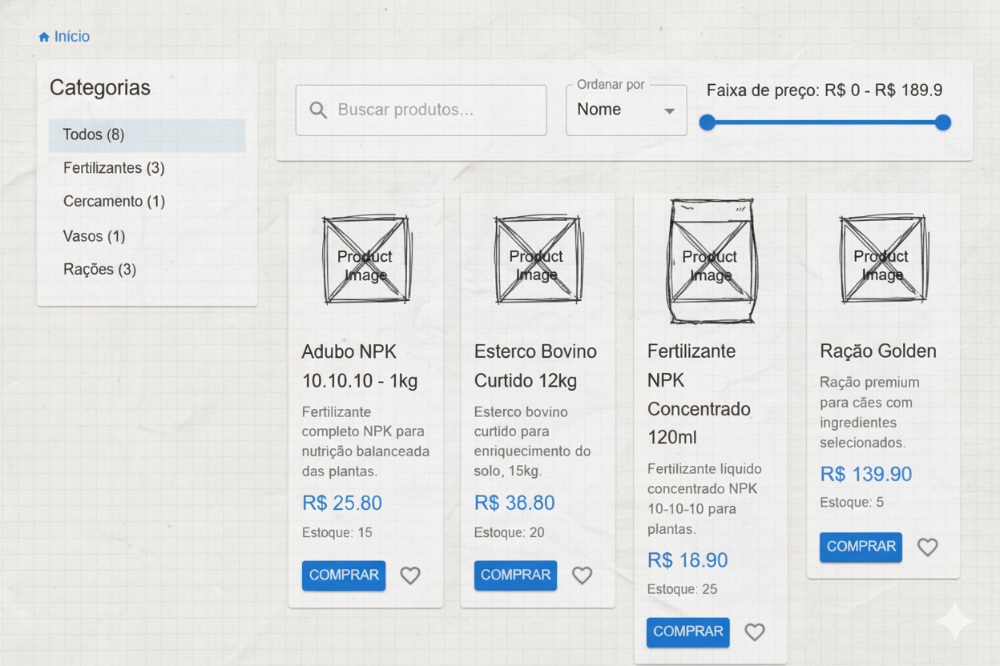
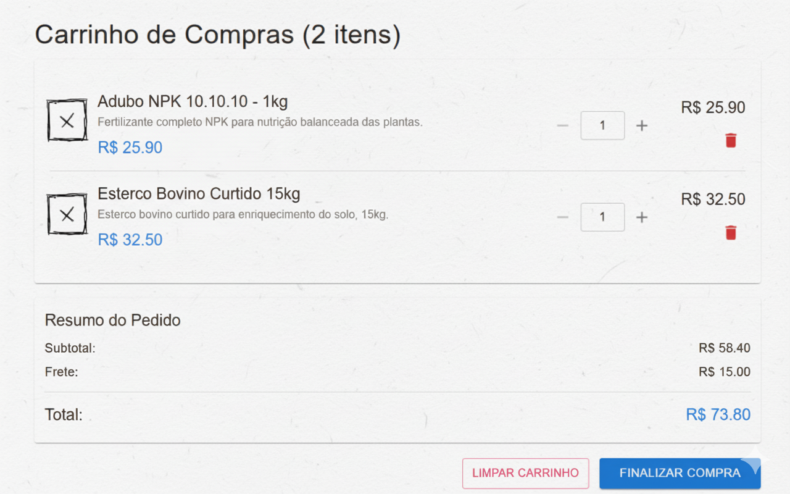
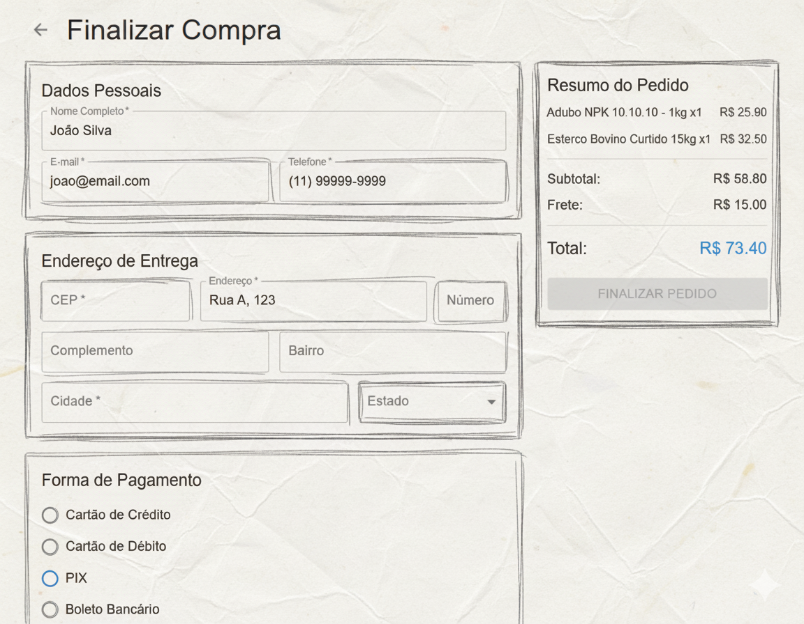
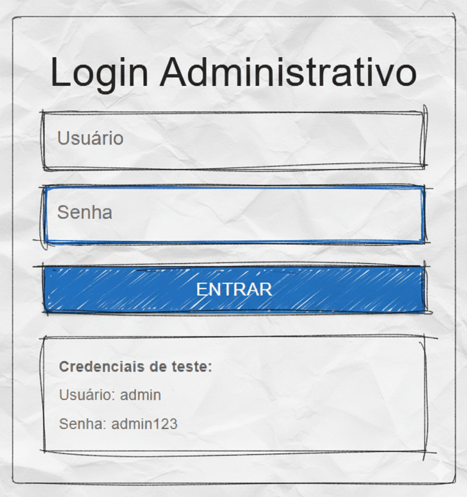
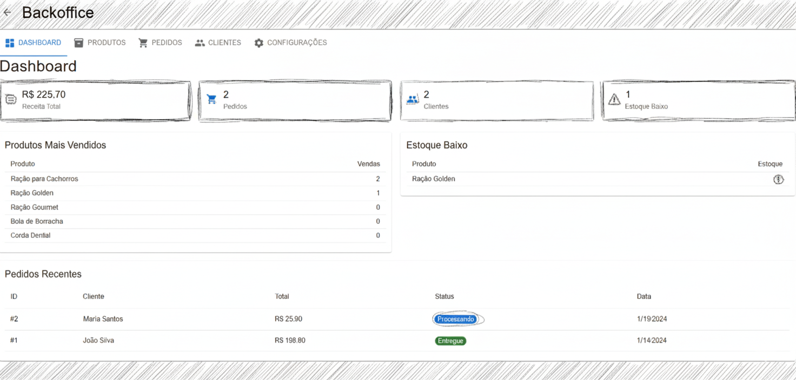
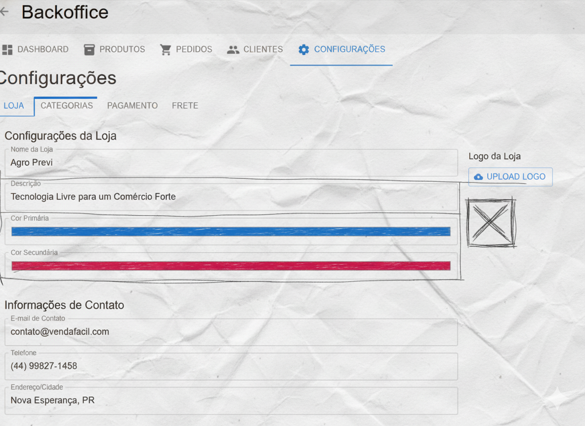

# VendaFácil

Uma aplicação de e-commerce moderna desenvolvida com React, TypeScript e Material-UI.

## Funcionalidades

- Catálogo de produtos
- Carrinho de compras com persistência local
- Interface responsiva
- Cálculo automático de frete
- Controle de estoque

## Tecnologias

- React 18
- TypeScript
- Material-UI (MUI)
- Vite
- Context API

## Como executar

```bash
npm install
npm run dev
```

## Deploy no GitHub Pages

1. Faça push do código para o repositório GitHub
2. Vá em Settings > Pages
3. Selecione "GitHub Actions" como source
4. O deploy será automático a cada push na branch main

URL: `https://seu-usuario.github.io/vendafacil/`

## 🎨 Protótipo de Interface — VendaFácil

O projeto **VendaFácil** foi desenvolvido como um e-commerce open source para pequenos empreendedores,
iniciando com a parceria da **Agro Previ Agropecuária**.

Abaixo estão os wireframes conceituais (estilo Balsamiq) que representam as principais telas do sistema:

### 🛒 Catálogo de Produtos


### 📦 Descrição do Produto


### 🧺 Carrinho de Compras


### 💳 Checkout


### 🔐 Login Administrativo


### ⚙️ Painel Administrativo


### 🏪 Configuração da Loja


## Open Source

Este é um software livre e de código aberto. Qualquer pessoa pode usar, modificar e distribuir este código livremente. O projeto está disponível sob os termos da licença MIT.

### Licença MIT

Permission is hereby granted, free of charge, to any person obtaining a copy of this software and associated documentation files (the "Software"), to deal in the Software without restriction, including without limitation the rights to use, copy, modify, merge, publish, distribute, sublicense, and/or sell copies of the Software, and to permit persons to whom the Software is furnished to do so.

THE SOFTWARE IS PROVIDED "AS IS", WITHOUT WARRANTY OF ANY KIND, EXPRESS OR IMPLIED.